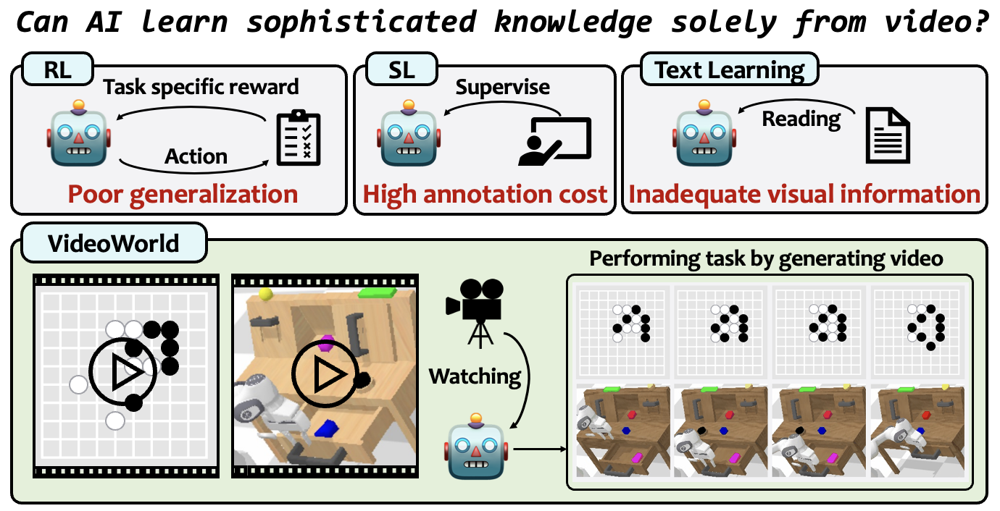
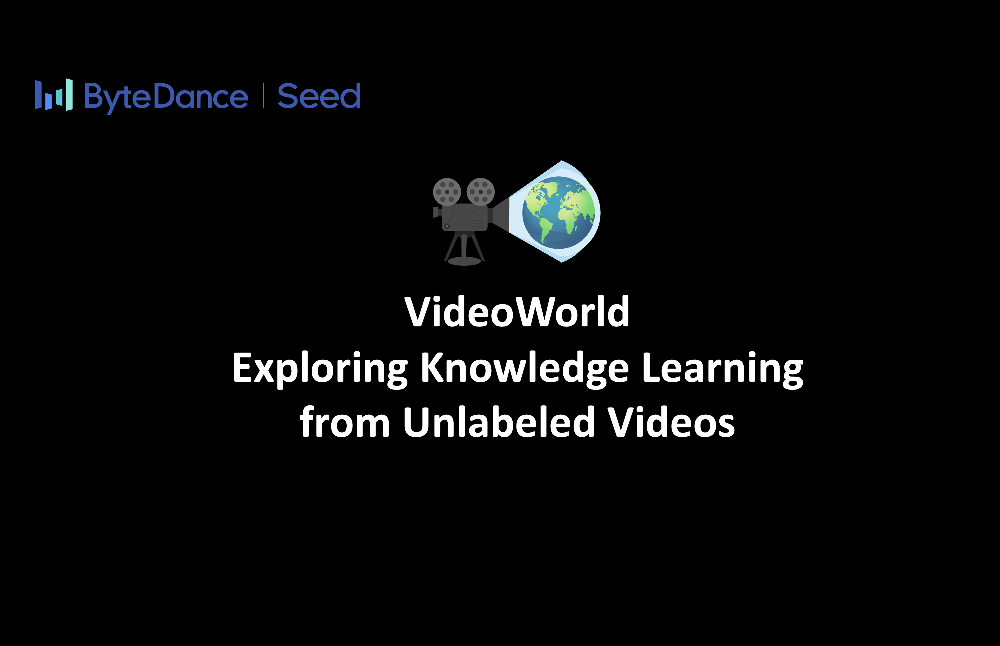

# VideoWorld: Exploring Knowledge Learning from Unlabeled Videos
> #### Zhongwei Ren, Yunchao Wei<sup>&dagger;</sup>, Xun Guo, Yao Zhao, Bingyi Kang, Jiashi Feng, and Xiaojie Jin<sup>&dagger;</sup><sup>&ddagger;</sup>
> <sup>&dagger;</sup>Correspondence, <sup>&ddagger;</sup>Project Lead

> Beijing Jiaotong University, University of Science and Technology of China, ByteDance Seed

<font size=7><div align='center' > <a href='https://arxiv.org/pdf/2501.09781'>**Paper**</a> | <a href="https://maverickren.github.io/VideoWorld.github.io">**Project Page**</a> | [**Installation**](#Install) | [**Training**](#training) | [**Inference**](#inference)  | <a href="https://huggingface.co/datasets/maverickrzw/VideoGo-Bench">**Video-GoBench**</a></div></font>




## :fire: News
* **[2025.1]** We release the code and dataset.

# Highlight

👉 We explore, for the first time, whether video generation models can learn knowledge and observe two key findings: i) merely observing videos suffices to learn complex tasks, and ii) compact representations of visual changes greatly enhance knowledge learning.

👉 We propose VideoWorld, leveraging a latent dynamics model to represent multi-step visual changes, boosting both efficiency and effectiveness of knowledge acquisition.

👉 We construct Video-GoBench, a large-scale video-based Go dataset for training and evaluation, facilitating future research on knowledge learning from pure videos.

# Introduction
This work explores whether a deep generative model can learn complex knowledge solely from visual input, in contrast to the prevalent focus on text-based models like large language models (LLMs). We develop \emph{VideoWorld}, an autoregressive video generation model trained on unlabeled video data, and test its knowledge acquisition abilities in video-based Go and robotic control tasks. Our experiments reveal two key findings: (1) video-only training provides sufficient information for learning knowledge, including rules, reasoning and planning capabilities, and (2) the representation of visual changes is crucial for
knowledge learning. To improve both the efficiency and efficacy of knowledge learning, we introduce the Latent Dynamics Model (LDM) as a key component of VideoWorld. Remarkably, VideoWorld reaches a 5-dan professional level in the Video-GoBench with just a 300-million-parameter model, without relying on search algorithms or reward mechanisms typical in reinforcement learning. In robotic tasks, VideoWorld effectively learns diverse control operations and generalizes across environments, approaching the performance of oracle models in CALVIN and RLBench. This study opens new avenues for knowledge acquisition from visual data, with all code, data, and models to be open-sourced for further research.

# Video
[](https://www.youtube.com/watch?v=y_TT4dtIPXA "VideoWorld Demo")

# Architecture


Overview of the proposed VideoWorld model architecture. (Left) Overall architecture. (Right) The proposed latent dynamics model (LDM). First, LDM compresses the visual changes from each frame to its subsequent H frames into compact and informative latent codes. Then, an auto-regressive transformer seamlessly integrates the output of LDM with the next token prediction paradigm.


# Installation

### Setup Environment
```
conda create -n videoworld python=3.10 -y
conda activate videoworld
pip install --upgrade pip  

pip install torch==2.1.0 torchvision==0.16.0 torchaudio==2.1.0 --index-url https://download.pytorch.org/whl/cu121
```
### Install VideoWorld
```
git clone https://github.com/bytedance/VideoWorld.git
cd VideoWorld

bash install.sh
```


# Inference
### Go Battle
The testing in our paper relies on the KataGo Go engine. Due to the complexity of KataGo's environment setup, we default to not using KataGo as the move evaluation engine. If you wish to use the KataGo engine for detailed move analysis, please use the script below or refer to the [official website](https://github.com/lightvector/KataGo) for installation, and replace the configuration file with go_battle_vs_human.py in the startup script.

```
# If you don't need to install KataGo, please do not run this.
cd VideoWorld # This VideoWorld is located in a subdirectory.
bash install_katago.sh 
```
We provide the [weight files](https://huggingface.co/maverickrzw/VideoWorld-GoBattle/blob/main) for playing against humans. Please place the various weights according to the following directory structure to start the test. VideoWorld will generate the latent code and the board image for the next move.
```
├── VideoWorld
│   ├── VideoWorld
│   │   └── work_dirs
│   │       │── go_fsq.pth 
│   │       │── go_battle.pth 
│   └──     └── Intern_300m
```

Then, use the script to start a match:
```
cd VideoWorld # This VideoWorld is located in a subdirectory.
bash ./tools/battle_vs_human.sh
```


### Robotics
Download CALVIN dataset follow the [official instructions](https://github.com/mees/calvin) and organize it as follows:
```
├── VideoWorld
│   ├── VideoWorld
│   │   │── data
│   │   │   └── calvin
│   │   └── work_dirs
│   │       │── Llama_tokenizer
│   │       │── calvin_model.pth 
│   │       │── calvin_fsq.pth 
│   └──     └── Intern_300m
```

Testing requires the CALVIN environment configuration. We have automated the installation of CALVIN in the install.sh script. If any issues arise, please refer to the official installation instructions
```
cd VideoWorld # This VideoWorld is located in a subdirectory.
# Since we only tested the tasks of opening drawers, pushing 
# blocks, and switching lights, the original CALVIN test task 
# construction script needs to be replaced.
rm -r ../calvin/calvin_models/calvin_agent/evaluation/multistep_sequences.py
cp ./tools/calvin_utils/multistep_sequences.py ../calvin/calvin_models/calvin_agent/evaluation/
bash ./tools/calvin_test.sh
```

If you encounter the error from the transformers library during inference:
```
bos_token_id has to be defined when no input_ids are provided
```
You need to modify your local transformers installation file. Replace lines 552-554 in the file located at "site-packages/transformers/generation/utils.py" with:
```
model_kwargs["input_ids"] = torch.ones((1, 0), dtype=torch.long, device=self.device)
```

# Training
Our training consists of two stages: LDM training and autoregressive transformer training. We use the CALVIN robotic environment as an example to demonstrate how to initiate the training.
### Stage 1: LDM Training
Download CALVIN dataset follow the official instructions and organize it as follows:
```
├── VideoWorld
│   ├── LDM
│   │   │── data
│   │   │   └── calvin
│   │   └── work_dirs
│   │       └── magvit_init.pth
│   │── VideoWorld     
│   │   └── work_dirs
│   │       │── Llama_tokenizer
│   │       │── calvin_fsq.pth 
│   └──     └── Intern_300m
         
```
To initiate LDM training, use the script ./LDM/tools/calvin_ldm_train.sh. The training requires the [Magvit weights](https://huggingface.co/maverickrzw/VideoWorld-GoBattle/tree/main) we pre-trained on natural image reconstruction as initialization—please place them at the specified path. Once training completes, the latent codes for the training set will be automatically saved to ./LDM/work_dirs/calvin_ldm_results.pth, and a UMAP visualization of these codes will also be generated.
```
cd LDM 
bash ./tools/calvin_ldm_train.sh
```
### Stage 2: Next Token Prediction
We incorporate the LDM-generated latent codes into the configuration, then initiate the autoregressive transformer training. Please store the dataset in the same path used for inference, and place the [tokenizer weights](https://huggingface.co/maverickrzw/VideoWorld-GoBattle/tree/main) in the location specified above.
```
cd VideoWorld 
bash ./tools/calvin_train.sh
```

# Citation
If you find this project useful in your research, please consider citing:
```
@misc{ren2025videoworldexploringknowledgelearning,
      title={VideoWorld: Exploring Knowledge Learning from Unlabeled Videos}, 
      author={Zhongwei Ren and Yunchao Wei and Xun Guo and Yao Zhao and Bingyi Kang and Jiashi Feng and Xiaojie Jin},
      year={2025},
      eprint={2501.09781},
      archivePrefix={arXiv},
      primaryClass={cs.CV},
      url={https://arxiv.org/abs/2501.09781}, 
}
```


